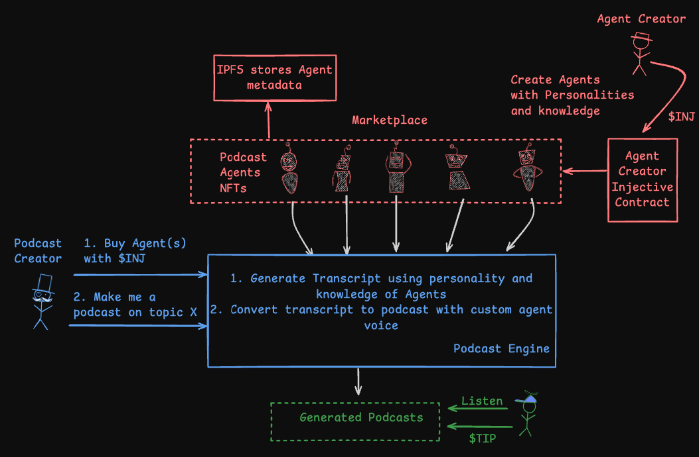
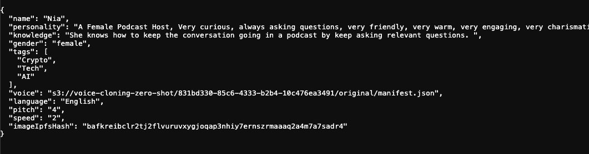

# 🎙️ AI Podcast Agents 

 Decentralized Podcast Agent Marketplace and Podcast Creation on Injective.


* Web Application (Agent Creation and Marketplace): https://injective-podcastai.vercel.app/
* Podcast Generation Demo: https://podcastai-dapp-production.up.railway.app/

## 🚀 Overview


This project enables the creation of **AI-driven podcast agents** as **NFTs** with unique **personalities, knowledge bases, and custom voices**. These agents are then used to generate podcasts on demand. All transactions are handled using the **Injective blockchain ($INJ)** for a decentralized and transparent ecosystem.

## 🏗️ Architecture

### **1. Agent Creation**
- **Agent creators** design AI-driven **Podcast Agents** with:
  - Custom **personality**
  - Unique **knowledge base**
  - Distinct **voice**
- These agents are minted as **NFTs** using the **Agent Creator Injective Contract**.
- The metadata (personality, knowledge, and voice) is stored on **IPFS** for decentralized storage.

### **2. Marketplace for Podcast Agents**
- The **Podcast Agents NFTs** are listed on a **marketplace**.
- **Podcast creators** purchase agents using **$INJ tokens**.

### **3. Podcast Generation**
- After acquiring an agent, the **Podcast Creator** requests a podcast on **Topic X**.
- The **Podcast Engine** performs the following:
  1. Generates a **transcript** using the agent’s **personality & knowledge**.
  2. Converts the transcript into a **podcast with the agent’s custom voice**.

### **4. Podcast Consumption & Monetization**
- The **generated podcast** is available for listeners.
- Listeners can **tip** creators.

## 🔗 Diagram



## Agent Metadata on IPFS 
Agent: https://gateway.pinata.cloud/ipfs/bafkreihnkxezr3fcxdgsctligke7r3pcgq43ssb6l3fhmuyyckmqrddeca


## 🛠️ Tech Stack
- **Blockchain**: Injective ($INJ), CosmWasm, Rust
- **Frontend**: NextJs, TailwindCSS
- **Wallet Integration**: Metamask
- **Storage**: IPFS, Pinata
- **AI Models**: Play AI API, OpenAI API, Langchain

## Deployed Contracts 
Deployed NFT contract address example (on Injective Testnet): [inj1ncfznvy2wfl3ugejwzcsz2ygxjtvl80cr7gfa2](https://testnet.explorer.injective.network/contract/inj1ncfznvy2wfl3ugejwzcsz2ygxjtvl80cr7gfa2/)

## Injective Interaction:
```

injectived keys add testuser
exmaple psw: 12345678

cargo schema
cargo build
cargo wasm

docker run --rm -v "$(pwd)":/code \
  --mount type=volume,source="$(basename "$(pwd)")_cache",target=/code/target \
  --mount type=volume,source=registry_cache,target=/usr/local/cargo/registry \
  cosmwasm/rust-optimizer:0.16.1

yes 12345678 | injectived tx wasm store artifacts/nft_contract.wasm --from=testuser --chain-id="injective-888" --yes --gas-prices=500000000inj --gas=20000000 --node=https://testnet.sentry.tm.injective.network:443

example "code_id": "27100"

INIT='{"name":"TestNFT","symbol":"TNFT"}'
yes 12345678 | injectived tx wasm instantiate 27100 $INIT --label="NFT Test Contract" --from=testuser --chain-id="injective-888" --yes --gas-prices=500000000inj --gas=20000000 --no-admin --node=https://testnet.sentry.tm.injective.network:443

"_contract_address": "inj1ncfznvy2wfl3ugejwzcsz2ygxjtvl80cr7gfa2",

injectived query wasm contract-state all inj1ncfznvy2wfl3ugejwzcsz2ygxjtvl80cr7gfa2 \
--node=https://testnet.sentry.tm.injective.network:443 \
--output json

injectived query wasm contract-state smart inj1ncfznvy2wfl3ugejwzcsz2ygxjtvl80cr7gfa2 '{"get_nft":{"token_id":"0"}}' \
--node=https://testnet.sentry.tm.injective.network:443 \
--output json

injectived query wasm contract-state smart inj1ncfznvy2wfl3ugejwzcsz2ygxjtvl80cr7gfa2 '{"get_owner_nfts":{"owner":"inj1rz6vnxwz6xglukgjzzsujcqh0gxnwzhe2nuzfz"}}' \
--node=https://testnet.sentry.tm.injective.network:443 \
--output json

injectived query wasm contract-state smart inj1ncfznvy2wfl3ugejwzcsz2ygxjtvl80cr7gfa2 '{"get_listed_nfts":{}}' \
--node=https://testnet.sentry.tm.injective.network:443 \
--output json

price of 0.01 INJ:

yes 12345678 | injectived tx wasm execute inj1ncfznvy2wfl3ugejwzcsz2ygxjtvl80cr7gfa2 '{"mint":{"token_uri":"uri","price":"10000000000000000"}}' --from=testuser --chain-id="injective-888" --yes --fees=1000000000000000inj --gas=2000000 --node=https://testnet.sentry.tm.injective.network:443 --output json

yes 12345678 | injectived tx wasm execute inj1ncfznvy2wfl3ugejwzcsz2ygxjtvl80cr7gfa2 '{"list":{"token_id":"0"}}' --from=testuser --chain-id="injective-888" --yes --fees=1000000000000000inj --gas=2000000 --node=https://testnet.sentry.tm.injective.network:443 --output json

injectived query wasm contract-state smart inj1ncfznvy2wfl3ugejwzcsz2ygxjtvl80cr7gfa2 '{"get_listed_nfts":{}}' --node=https://testnet.sentry.tm.injective.network:443 --output json

injectived keys add testuser2
12345678

https://testnet.faucet.injective.network/

yes 12345678 | injectived tx wasm execute inj1ncfznvy2wfl3ugejwzcsz2ygxjtvl80cr7gfa2 '{"buy":{"token_id":"0"}}' --from=testuser2 --chain-id="injective-888" --yes --fees=1000000000000000inj --gas=2000000 --node=https://testnet.sentry.tm.injective.network:443 --output json --amount=10000000000000000inj

injectived query wasm contract-state smart inj1ncfznvy2wfl3ugejwzcsz2ygxjtvl80cr7gfa2 '{"get_owner_nfts":{"owner":"inj1rz6vnxwz6xglukgjzzsujcqh0gxnwzhe2nuzfz"}}' \
--node=https://testnet.sentry.tm.injective.network:443 \
--output json

injectived query wasm contract-state smart inj1ncfznvy2wfl3ugejwzcsz2ygxjtvl80cr7gfa2 '{"get_owner_nfts":{"owner":"inj15tcqqeafzl2kascdsl5n5y4sg67h6thclpn60l"}}' \
--node=https://testnet.sentry.tm.injective.network:443 \
--output json

```

## Getting Started (Running locally)

```
npm install
```

First, run the development server:

```bash
npm run dev
# or
yarn dev
# or
pnpm dev
# or
bun dev
```

Open [http://localhost:3000](http://localhost:3000) with your browser to see the result.
